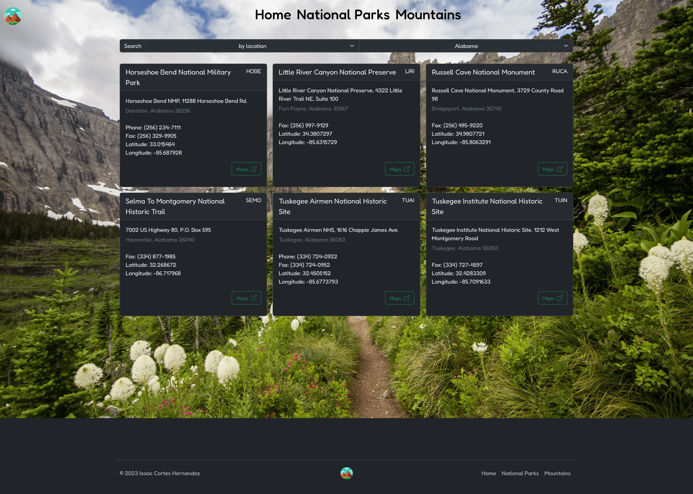
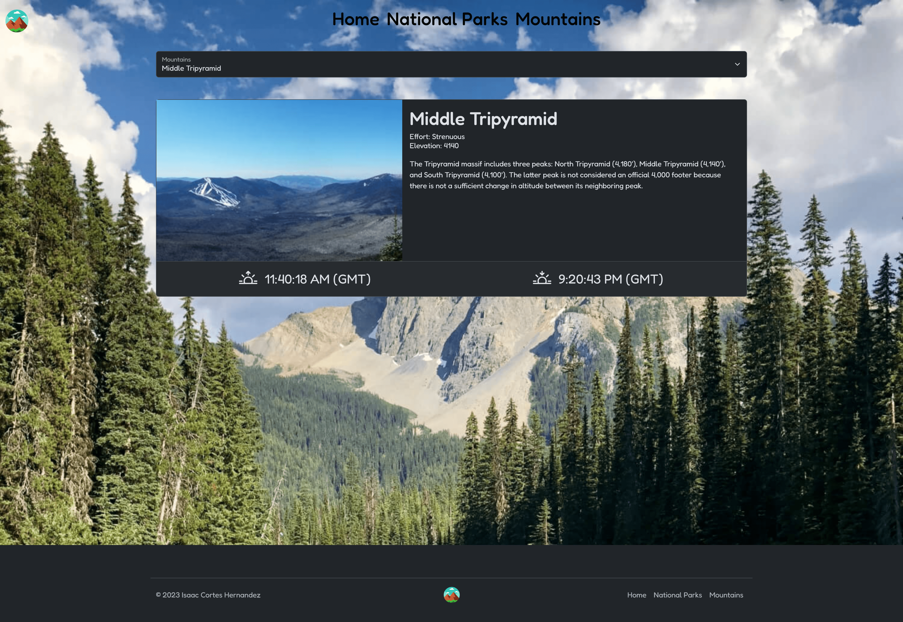

# Enjoy the Outdoors - Capstone 2

[SummitQuest](https://summitquest.isaaccortes.com/) is a full-stack web application specializes in finding national parks to enjoy and mountains to climb.

## Pages

### Home 


### National Parks


### Mountains


## Code Highlight

```Typescript
import prisma from '../../../../../../prisma/prisma';

export async function GET(request: Request,{ params }: { params: { parktype: string } }) {
  try {
    if (params.parktype == 'All') {
      const data = await prisma.national_park_data.findMany({});
      return Response.json(data);
    } else {
      let data = await prisma.national_park_data.findMany({
        where: {
          LocationName: {
            contains: params.parktype,
            mode: 'insensitive',
          },
        },
      });

      return Response.json(data);
    }
  } catch (error) {
    return Response.json(error);
  }
}
```
### Step by Step:

1. **Import Statement**
    ```Typescript
    import prisma from '../../../../../../prisma/prisma';
    ```
    Imports the Prisma client instance. Prisma is an Object-Relational Mapping (ORM) tool used to interact with databases.

2. **Function Declaration**
    ```Typescript
    export async function GET(request: Request,{ params }: { params: { parktype: string } }) {
    ```
    Declares an dynamic asynchronous function named GET that takes an object with a params property. The `{ params: { parktype: string } }` is specifying the data type of the parameters.

3. **Try-Catch Block**
    ```Typescript
    try {
    ```
    The code inside the try block attempts to execute, and if any errors occur during the execution, they will be caught in the associated catch block.

4. **Conditional Check**
    ```Typescript
    if (params.parktype == 'All') {
    ```
    Checks if the value of `params.parktype` is equal to the string 'All'.

5. **Database Query (1st Block)**
    ```Typescript
    const data = await prisma.national_park_data.findMany({});
    return Response.json(data);
    ```
    If `params.parktype` is 'All', it queries all data from the `national_park_data` collection using Prisma and returns the data as a JSON response.

6. **Database Query (2nd Block)**
    ```Typescript
    else {
      let data = await prisma.national_park_data.findMany({
        where: {
          LocationName: {
            contains: params.parktype,
            mode: 'insensitive',
          },
        },
      });

      return Response.json(data);
    }
    ```
    If `params.parktype` is not 'All', it queries data from the `national_park_data` collection where the `LocationName` contains the specified `parktype`. The `mode: 'insensitive'` ensures a case-insensitive search. The result is then returned as a JSON response.

7. **Catch Block**
    ```Typescript
    catch (error) {
      return Response.json(error);
    }
    ```
    Catches any errors that occurred during the execution of the try block and returns the error as a JSON response.


## Built With

* [Nextjs](https://nextjs.org/docs)
* [React](https://react.dev/reference/react)
* [Bootstrap](https://getbootstrap.com/docs/5.3/getting-started/introduction/)
* [Bootstrap Icons](https://icons.getbootstrap.com/)
* [Typescript](https://www.typescriptlang.org/docs/)
* [Zustand](https://docs.pmnd.rs/zustand/getting-started/introduction)
* [MongoDB](https://www.mongodb.com/docs/)
* [Prisma ORM](https://www.prisma.io/docs/getting-started)

## Deployed Link

* [See Live Site](https://summitquest.isaaccortes.com/)

## Author

* **Isaac Cortes Hernandez** 
  - [Link to Portfolio Site](https://portfolio.isaaccortes.com)
  - [Link to Github](https://github.com/icortes)
  - [Link to LinkedIn](https://www.linkedin.com/cortes-isaac)

## License

This project is licensed under the MIT License 

## Acknowledgments

* Prisma docs
* Nextjs docs
* Zustand docs
* Stack Overflow
